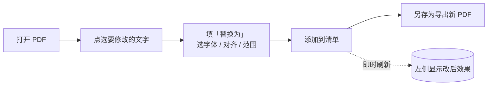
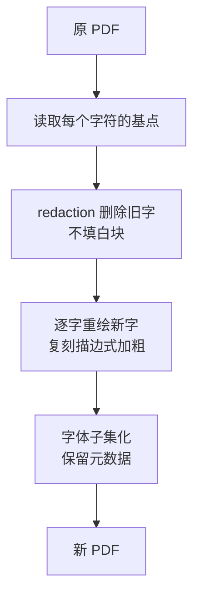

# PDFTextEditor

**PDF 文字原位修改工具** —— 直接修改电子文本 PDF 中的文字，并让改动在视觉上与原文件保持一致：
沿用原字体、字号、位置与加粗效果，表格线、版式、页面尺寸均不受影响。

> **适用**：Word 等 Office 软件导出的可选中文本 PDF（文字可选中 / 可搜索）。
> **不适用**：扫描件等图片型 PDF。

---

## 主要特性

- **图形界面**：在预览里点选文字 → 填新内容 → 添加到清单，改后效果即时可见
- **命令行**：按 `config.json` 批量替换，便于自动化与复用；支持 `--dry-run` 预演
- **字体覆盖广**：自动列出本机可用的 20+ 种中文字体，也可指定任意 `.ttf / .ttc / .otf`
- **原位重绘**：逐字符定位，字距与对位与原文件一致，不破坏表格与版式
- **加粗还原**：识别原文件的描边式"伪加粗"并等比复刻，避免换字体露馅
- **安全写入**：始终从原文件重新生成，只有"另存为"时才写出新文件
- **收尾处理**：内嵌字体子集化控制体积，保留原 PDF 的元数据与时间戳
- **可打包**为免安装单文件 `exe`（PyInstaller），双击即用

---

## 使用流程



勾选 **对比预览** 可并排查看「原图 / 改后」，两侧缩放与滚动同步；
鼠标滚轮为滚动、`Ctrl` + 滚轮为缩放（以鼠标位置为中心）、`Shift` + 滚轮横向滚动。

---

## 快速上手（图形界面）

1. **打开 PDF**。
2. 在左侧预览中**点击要修改的文字**，它会高亮，并自动带出字体、字号与左边框。
3. 在右侧「替换为」里输入新文字；按需调整字体、字号、对齐（保持原位 / 左对齐留白）、
   范围（所有相同文本 / 仅选中这一处），然后点**添加到清单**。
4. 点**另存为…** 导出新的 PDF。

---

## 命令行

```bash
python edit_pdf.py --config config.json --dry-run    # 先看会匹配到哪些片段
python edit_pdf.py --config config.json              # 正式生成
```

## 配置文件（config.json）

```json
{
  "src": "input.pdf",
  "out": "output.pdf",
  "font": "C:\\Windows\\Fonts\\simsun.ttc",
  "font_size": 10,
  "bold_stroke": 0.03,
  "replacements": [
    { "old": "原文本示例", "new": "新文本示例" },
    { "old": "旧事由示例", "new": "新事由示例",
      "align": "left", "left_border_x": 100.0, "left_gap": 3.333 }
  ]
}
```

- `scope`：`all` 替换全部相同文本，`single` 仅替换 `page` + `bbox` 指定的一处
- `align`：`left` 时从 `left_border_x + left_gap` 起左对齐
- 图形界面的「导出 config」与命令行**通用**

---

## 工作原理



## 技术要点

- **逐字符定位**：读取每个字符的基点后重绘，避免整段重排造成的字距误差
- **加粗与字形**：许多导出器的"加粗"是内容流里的描边（`2 Tr`）实现，程序以同样方式复刻
- **删除旧字**：使用 redaction **且不填充白块**，避免在部分阅读器中留下可见边框
- **收尾**：字体子集化 + 保留 `Producer / Creator / 时间戳` 等元数据

---

## 运行环境与打包

- **Python 3.9+**：PyMuPDF、fontTools、numpy（图形界面另需 Tkinter，Windows 自带）
- **打包**：

  ```powershell
  powershell -ExecutionPolicy Bypass -File build_exe.ps1
  ```

- **产物**：`worktemp\pyinstaller\dist\PDFTextEditor.exe`（免安装单文件）
- 首次运行会在 `%LOCALAPPDATA%\PDFTextEditor` 生成字体缓存，不依赖 exe 所在目录可写

## 目录结构

```
PDFTextEditor/
├── pdf_edit_core.py     核心：匹配 / 定位 / 删除 / 重绘 / 收尾
├── edit_pdf.py          命令行入口
├── pdf_editor_gui.py    图形界面入口
├── config.example.json  配置模板
├── build_exe.ps1        打包脚本
├── assets/              图标资源
├── worktemp/            构建与临时产物（已忽略）
└── README.md
```

---

## 说明

本工具用于修改**你有权修改**的文档，请遵守相关法律法规及所在学校 / 单位的规章制度。
