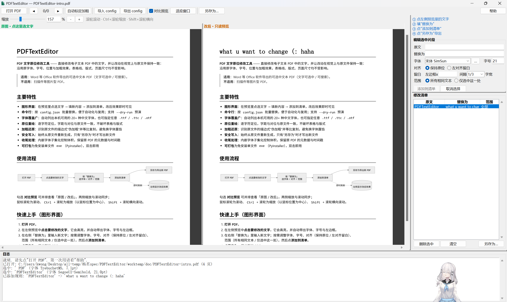

# PDFTextEditor

在**电子文本 PDF** 上原地修改文字，并尽可能让改动在视觉上与原文件一致。
适用于 Word 等 Office 软件导出的可选中文本 PDF，不适用于扫描件。

嘿嘿（￣︶￣）↗　本来是用来p假条的，顺便小改pdf的，后来pymupdf基础上加GUI,简化了命令行里的一些操作。

目前纯个人使用，我也不知道还有什么bug，界面撕裂什么的就先不管了，能p就是好 (:



---

## 下载

从 [Releases](../../releases) 下载 `PDFTextEditor-Portable-<版本>.zip`，
解压到任意位置，
双击 `PDFTextEditor.exe` 就能用。
「卸载」＝把解压出来的文件夹删掉。

- 系统要求：**64 位 Windows 10 及以上**
- 别放在 `C:\Program Files` 这类需要管理员权限的目录，否则字体缓存写不进去
- 首次运行若弹「Windows 已保护你的电脑」，点「更多信息 → 仍要运行」
- 解压后目录里有 `使用说明.txt`；首次修改文字会在 `data\` 生成字体缓存，可随时删除

> 想从源码运行、或自己重新出包，见下面的「源码运行」与「打包exe」。

---

## 源码运行

### 1. 安装依赖

```bash
pip install -r requirements.txt
```

### 2. 图形界面

```bash
python pdf_editor_gui.py
```


### 3. 命令行

```bash
copy config.example.json config.json
python edit_pdf.py --config config.json --dry-run   # 先看会匹配到哪些片段
python edit_pdf.py --config config.json             # 生成
```

---

## 配置

GUI 的「导出 config / 导入 config」与 CLI 使用**同一套格式**，可以互相复用。

```jsonc
{
  "src": "原文件路径（相对 config 所在目录或绝对路径）",
  "out": "输出路径",
  "font": "C:\\Windows\\Fonts\\simsun.ttc",  // 全局默认字体文件
  "font_name": "simsun",
  "font_size": 10,          // 全局默认字号
  "bold_stroke": 0.03,      // 伪加粗描边宽度（见下文）
  "replacements": [
    { "old": "原文", "new": "新文" },

    // 左对齐并留出边框间距（间隙以"字宽"为单位 → pt = 比例 × 字号）
    { "old": "原文", "new": "新文",
      "align": "left", "left_border_x": 158.88, "left_gap": 3.333 },

    // 只改指定的一处（多份相同文本时用）
    { "old": "原文", "new": "新文",
      "scope": "single", "page": 0, "bbox": [100.0, 200.0, 160.0, 210.0] },

    // 覆盖全局字体/字号/描边
    { "old": "原文", "new": "新文", "font_size": 12, "bold_stroke": 0.04 }
  ]
}
```

字段全部向后兼容：缺省字段沿用全局默认。

| 字段 | 说明 |
|---|---|
| `scope` | `all`（默认）替换全部相同文本；`single` 仅替换 `page`+`bbox` 指定的一处 |
| `align` | 缺省按原基点重绘；`left` 从 `left_border_x + left_gap` 起左对齐 |
| `bbox` | PDF 坐标 `[x0,y0,x1,y1]`，`scope=single` 时用于精确定位 |


---

## 打包exe

推荐在项目内的**虚拟环境**里打包，避免影响全局 Python（venv 放项目根的 `.venv`，已被 .gitignore 忽略）：

```powershell
# 1) 建虚拟环境并安装依赖（只需一次）
#    请用 64 位 Python 建 venv（py -0p 可列出本机所有版本）
py -3.14 -m venv .venv
.\.venv\Scripts\python.exe -m pip install -r requirements.txt pyinstaller

# 2) 打包（默认 onedir，启动快）
powershell -ExecutionPolicy Bypass -File build_exe.ps1
# 想要单文件版：加 -Onefile   想看报错：加 -Console
```

> 分发给别人时请用 **64 位** Python 建 venv（32 位包有 4 GB 内存上限）。
> 自查：`.\.venv\Scripts\python.exe -c "import struct;print(struct.calcsize('P')*8)"` 应输出 `64`。

`build_exe.ps1` 会自动优先使用 `.venv`（没有则退回全局 python）。
打包的**中间产物与输出都写到 `worktemp\pyinstaller\`**（已忽略）：

- 默认 `--onedir` → `worktemp\pyinstaller\dist\PDFTextEditor\PDFTextEditor.exe`
- 加 `-Onefile` → `worktemp\pyinstaller\dist\PDFTextEditor.exe`

字体缓存位置：程序目录里有 `portable.flag`（便携版）时写在**程序目录的 `data\`**，
否则写在 `%LOCALAPPDATA%\PDFTextEditor`。

### 便携版

```powershell
powershell -ExecutionPolicy Bypass -File build_portable.ps1
```

一条命令完成：读 `VERSION` → onedir 构建 → 复制到 `worktemp\portable\PDFTextEditor\` →
放入 `portable.flag` 和 `packaging\使用说明.txt` → 压成
`worktemp\portable\PDFTextEditor-Portable-<版本>.zip`，并打印大小与 SHA256。


